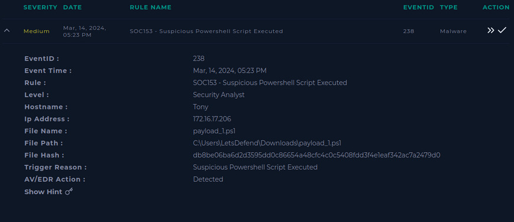
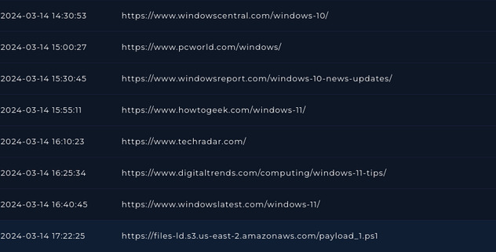
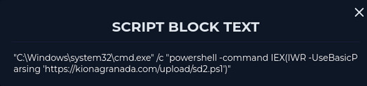
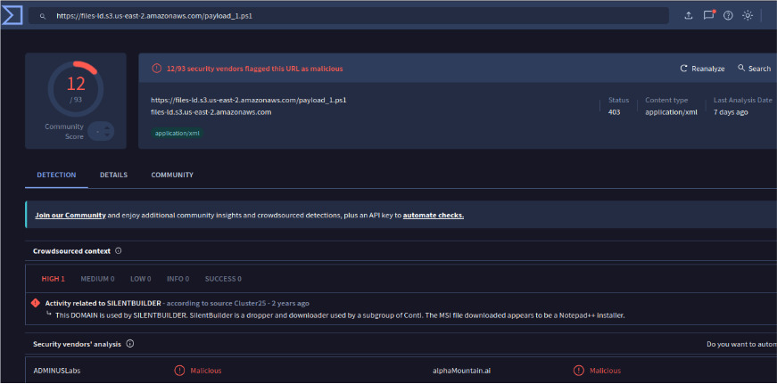

# INC-CASE2 Malware Analysis: payload_1.ps1

## 1. Resumen Ejecutivo

* **ID del Caso:** CASE-2
* **Severidad:** Alta
* **Veredicto:** True Positive - Actividad Sospechosa Detectada
* **Breve descripción:** Se detectó la descarga y posible ejecución de un script PowerShell sospechoso (`payload_1.ps1`) desde una URL externa reportada previamente como maliciosa. Durante la investigación se observaron conexiones HTTPS salientes iniciadas por `powershell.exe`, lo que podría indicar actividad relacionada con malware o ejecución remota de código.

---

## 2. Información del Artefacto

| Atributo               | Valor                                                        |
| :--------------------- | :----------------------------------------------------------- |
| **Nombre del Archivo** | payload_1.ps1                                                |
| **Hash SHA256**        | No identificado públicamente                                 |
| **Detección AV**       | Sin coincidencias en VirusTotal, Cisco Talos y MalwareBazaar |
| **Tipo de archivo**    | Script PowerShell (.ps1)                                     |

---

## 3. Análisis de Comportamiento (Dinámico)

*Basado en eventos observados en Endpoint y Log Management.*

### Actividad de Red

* **URL observada:** `https://files-ld.s3.us-east-2.amazonaws.com/payload_1.ps1`
* **IP observada:** `161.22.46.148`
* **Protocolo:** HTTPS (Puerto 443)

La URL utilizada para descargar el script fue analizada posteriormente y presentaba múltiples reportes asociados a actividad maliciosa en VirusTotal.

### Actividad en el Sistema

* Se identificó la ejecución de `powershell.exe`
* Parent Process detectado: `explorer.exe`
* Se observó una conexión HTTPS saliente iniciada desde PowerShell
* La conexión fue exitosa

### Persistencia

No se observaron mecanismos claros de persistencia durante la investigación. Tampoco se identificaron modificaciones en registro ni tareas programadas asociadas al incidente.

---

## 4. Mapeo MITRE ATT&CK

* **Táctica:** Execution

* **Técnica:** T1059.001 - PowerShell

* **Táctica:** Command and Control

* **Técnica:** T1071.001 - Web Protocols

* **Táctica:** Ingress Tool Transfer

* **Técnica:** T1105 - Ingress Tool Transfer

---

## 5. Respuesta al Incidente (Remediación)

1. **Contención:** El host involucrado fue aislado preventivamente de la red para evitar posible propagación o comunicación externa.
2. **Erradicación:** No fue posible confirmar el comportamiento completo del script debido a la falta de acceso a Sandbox.
3. **Recuperación:** El caso fue escalado para análisis avanzado y validación de posible compromiso del endpoint.

---

## 6. Evidencia (Capturas de Pantalla)

> *Capturas del Endpoint, Log Management y análisis de URL.*

> 
> *Figura 1: Alerta generada.*

> 
> *Figura 1: URL donde descargo el script que genero la alerta.*

> 
> *Figura 1: Conexión HTTPS saliente iniciada desde powershell.exe.*

> 
> *Figura 2: URL reportada previamente como sospechosa en plataformas de Threat Intelligence.*
